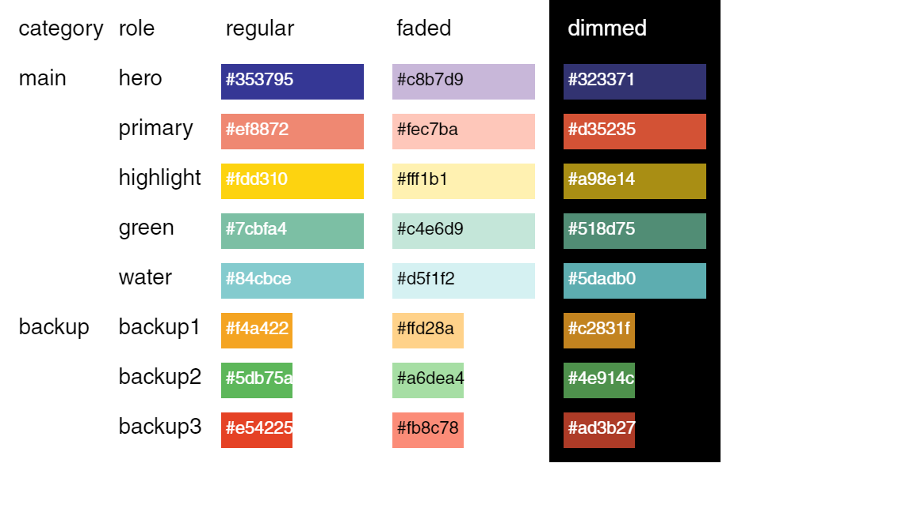

# Python Visualization Presets

This repository is used to store presets when doing visualization in Python, primarily using matplotlib. The first part 

### Part I: Create a Palette System and Build Your Own Color Ramps/Maps

#### 1. Intro

The first part is to create a palette system like the one below. My codes include the functions used to create this palette as well as the final palette output (stored as a `pandas.DataFrame`)



#### 2. Usage

To use my palette and functions, simply include the following the following lines at the beginning of your python file or notebook:

```python
!curl -O https://raw.githubusercontent.com/Leejere/python-visualization-preset/main/colors.py
%run colors.py
```

**TO MODIFY THIS PALETTE**, read the documentation [Setting the Palette](https://github.com/Leejere/python-visualization-preset/blob/main/set_colors.ipynb) and understand how the palette system got created. Then, you can fork this repo and modify `color.py` wherever it says `PLEASE INPUT VALUES HERE`.

#### 3. Documentation

The codes are clearly annotated and explained in the various Jupyter Notebooks files here.

- [Setting the Palette](https://github.com/Leejere/python-visualization-preset/blob/main/set_colors.ipynb) explains the **structure of my palette system** and documents how it gets created in detail.
- [Convert colors](https://github.com/Leejere/python-visualization-preset/blob/main/convert_colors.ipynb)) sets up the underlying converting functions among RGB, HSL and hex. These functions are useful because my palette system relies on tweaking **saturation** and **lightness** to create variations.
- [Create color ramps](https://github.com/Leejere/python-visualization-preset/blob/main/create_color_ramps.ipynb)) documents the functions to create **discrete** color ramps based off of one or two theme color(s).
- [Customized Matplotlib Color Maps](https://github.com/Leejere/python-visualization-preset/blob/main/customized_matplotlib_cmaps.ipynb)) documents the functions to create **continuous** color maps (matplotlib) based off of one or two theme color(s).

#### 4. Functions

##### Color conversions

1. Converting from HSL to RGB. Takes three values: H, S, and L. Outputs a list of three values, namely the R, G, and B values.

```python
hsl_to_rgb(hue, # numeric, 0-360
           saturation, # numeric, percentage, 0-100
           lightness # numeric, percentage, 0-100
          )
```

2. Converting from RGB to hex. Takes three values: R, G, and B. Outputs a string starting with "#" which the hex of the color.

```python
hsl_to_rgb(red, # numeric, 0-255
           green, # numeric, 0-255
           blue # numeric, 0-255
          )
```

3. Converting from HSL to hex. Takes three values: Takes three values: H, S, and L. Outputs a string starting with "#" which the hex of the color.
